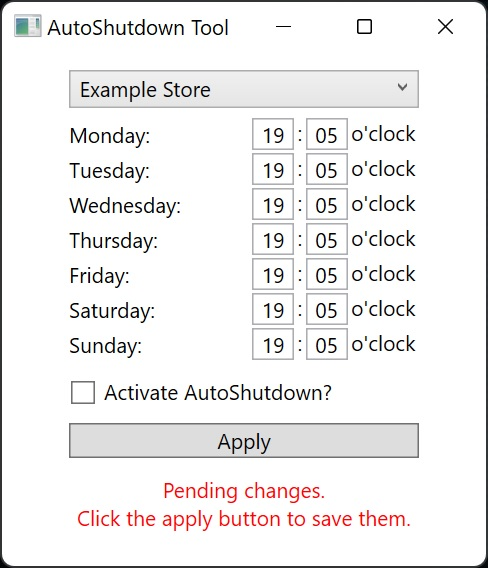

# PC-AutoShutdownTool

A simple daily auto-shutdown tool for Windows computers, made with .NET 6 and WPF (C#).

Originally created for computer stores to automatically shutdown display PCs on daily store closing times.

Uses the C# Task Scheduler Managed wrapper: https://github.com/dahall/TaskScheduler (MIT license)
## Usage

- Download and unpack the tool (or build it yourself)
- Run the .exe file
- Enter desired shutdown times for each day of the week
- Check the checkbox
- Hit the apply button

The tool will automatically create scheduled shutdown tasks in the windows task scheduler.  
The StoreConfig.xml contains different stores with predefined shutdown times for each weekday, feel free to edit it - just keep it next to the .exe file.
If the checkbox is not ticked, all daily tasks (which were created by the tool) will be deleted when clicking the apply button.
## Preview

## Supported Platforms

- Windows 10/11 x86-64
- Windows 10/11 ARM64

## Authors

- Hannes Trebbin ([@Armynator](https://www.github.com/armynator))
- Dominik Maccani ([Niwasaka](https://github.com/arcanumartis))

Also credit to David Hall ([@dahall](https://github.com/dahall)) for creating the [Task Scheduler C# Wrapper](https://github.com/dahall/TaskScheduler).
## License

Licensed under the [MIT](license.md) license.

